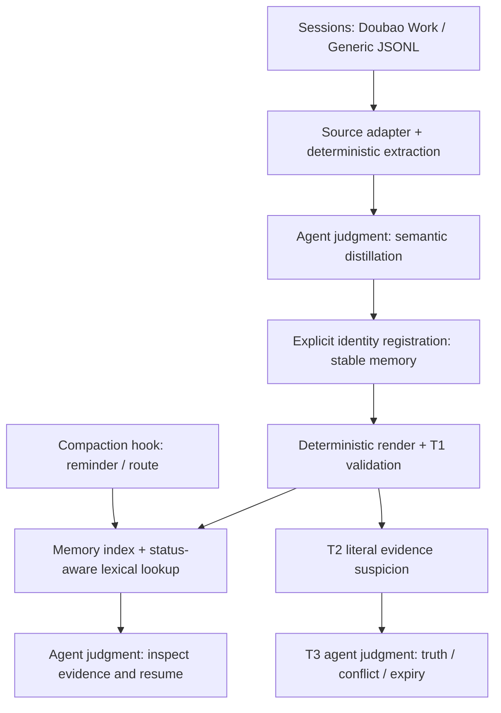

# chat-distiller

**Structured Agent Memory & Context Recovery for long-running AI agents.**

### 0.2.0 · 可安装的 Memory Engine

新增可导入的只读 `MemoryStore`、统一 `chat-distiller` 命令，以及保留来源与状态的有界恢复包。
原有脚本、稳定身份、v2 数据格式与词面检索算法保持兼容；不需要迁移已有 v2 vault。
同时修复笔记 `status` / `kind` 漂移未被查询阻断的缺口。

```bash
python3 -m pip install .
chat-distiller inspect --vault /path/to/vault
chat-distiller recover --vault /path/to/vault --query '当前任务的历史决策与限制' --max-bytes 4096
```

```python
from chat_distiller import MemoryStore, serialize_packet
memory = MemoryStore("/path/to/vault")
packet = memory.recover("当前任务的历史决策与限制", max_bytes=4096)
wire = serialize_packet(packet)  # 完整 UTF-8 JSON 字节预算，不是 token 预算
```

本地实测 **137 项测试通过 + 独立 wheel 安装后的 16 项检查通过**；原合成 benchmark 输出保持不变。
[接口与边界](docs/memory-engine.md) · [复现步骤与验证记录](docs/verification.md)

下面的评测仍是旧有的合成开发集，不表示这次改造提升了模型效果。

当上下文被 compaction、会话切换或长期任务打断，历史决策的理由、当前状态和来源
可能不再可见。本项目把对话蒸馏为可检查的外部记忆，再通过轻量检索帮助恢复工作上下文。
它提供恢复入口，不保证找回所有信息，也不自动判断记忆是否真实或仍然有效。

```text
Conversation → deterministic extraction → agent semantic distillation
→ stable structured memory → deterministic validation
→ status-aware lexical retrieval → context recovery
```

**Judgment belongs to the Agent; structure and integrity belong to deterministic code.**

- **Stable identity**：持久化 UUID 身份与 S/C 展示编号分离；重排、编辑、增量摄入不改变已有身份。
- **Lifecycle**：现行 / 已过期 / 有争议；稳定 ID 解析来源、关联与替代关系。
- **Recovery hook**：PreCompact 留 pending 标记；压缩后提示按问题检索，不灌入整库内容。
- **Portable**：Doubao Work 与 Generic JSONL 两种输入；确定性工具仅用 Python 标准库；语义蒸馏由宿主 Agent 完成，无需单独接入模型服务。
- **137 个测试**：保留原有 101 项回归，新增 36 项包接口、状态漂移、恢复预算与故障注入验证；另有独立安装后的 16 项端到端检查。

## Development evidence — synthetic, offline

固定 **40 个合成会话 / 40 张卡片 / 24 个 query**，不是生产准确率或真实用户效果。
人工编写蒸馏卡片；未评估自动蒸馏质量或 Agent 最终回答。

| Method | Recall@1 | Recall@3 | Recall@5 | MRR@5 | stale-hit@5 |
| --- | --- | --- | --- | --- | --- |
| Raw transcript lexical baseline | 0.4167 | 0.8750 | 0.9583 | 0.6528 | 0.5417 |
| Structured memory | 0.5417 | 0.9583 | 1.0000 | 0.7604 | 0.5000 |
| Structured + status-aware | 0.7083 | 0.8750 | 0.9167 | 0.7931 | 0.0000 |

**失败也保留**：现行优先会压低相关争议卡片，status-aware 的 Recall@5 低于纯结构化检索。
完整的 stale/controversial-hit@1/3/5、逐题结果与字符数见
[实际运行结果](benchmarks/benchmark-results.md) / [JSON](benchmarks/benchmark-results.json)。
MRR 截断到前 5；hit 指包含至少一个该状态结果的 query 占比。争议命中不一定是错误。
这些是 synthetic development evidence，不是 production accuracy。

报告新增 current-state、historical/superseded、conflict/controversial、cross-session、
compaction-recovery 五类 query intent 汇总，原 aggregate 保留。当前状态题与历史回溯分开解释：
历史检索可启用 non-current，旧卡片出现不自动算污染；争议题区分目标争议召回与任意争议暴露。
固定 fixture 没有以已过期卡片为 expected answer 的题，**expired-target recall 尚未测量**。

## Architecture



## Quick start

Python 3.9+。Deterministic tooling: Python standard library only。
Semantic distillation: performed by the host Agent；no separate model-service dependency。
Obsidian 是可选阅读器；宿主 Agent 仍负责语义判断。

```bash
# 1. 两种来源任选其一
python3 scripts/extract_sessions.py --sessions-root /path/to/.sessions --out _kb_staging
python3 scripts/extract_sessions.py --source generic_jsonl --input messages.jsonl --out _kb_staging

# 2. Agent 读转录，按 references/distillation-schema.md 写 distill.json
# 3. 新 source：initialize identity（首次分配，无需先有旧库）
python3 scripts/migrate_memory.py --mode init --distill distill.json --dry-run
python3 scripts/migrate_memory.py --mode init --distill distill.json --out memory-v2.json --report identity-report.json

# 4. 渲染与校验（vault 目录须已存在）
python3 scripts/render_notes.py --distill memory-v2.json --vault /path/to/vault --dry-run
python3 scripts/render_notes.py --distill memory-v2.json --vault /path/to/vault
python3 scripts/lint_notes.py --vault /path/to/vault --transcripts _kb_staging/transcripts

# 5. 恢复当前任务需要的历史知识
python3 scripts/query_memory.py --vault /path/to/vault --query '之前为什么不用 Docker？' --top-k 5
```

**已有 vault 请先走[显式迁移流程](references/stable-memory.md)**，不要直接拿新身份覆盖旧库。

## Memory identity and compatibility

`memory_id: mem_<32 位 UUID4 hex>` 是机器身份；`display_id: C14` 是展示编号。
唯一身份权威是完整 v2 源文档中的 `identity_registry`；对象身份字段是须核对的引用。
vault 源快照是已发布版本，独立登记表与笔记是派生副本；副本漂移时拒绝渲染和检索，不自动覆盖。
登记表保留退役身份、展示编号与固定文件名，不复用。标题可以编辑，文件路径保持原样。

同一个脚本用 `--mode init` 初始化新源身份，`--mode upgrade --vault ...` 升级旧库，
`--mode register` 登记 v2 增量。省略 mode 保持原 CLI 兼容。`--dry-run` 不写文件，
输出完整映射报告；预览分配的 UUID 只是临时值，持久化后的源才是身份依据。
已有 vault 迁移用 `--vault` 验证最后一份旧源与实际文件一致，冲突停止，不按标题猜测。

旧格式仍可在旧库渲染；旧版的顺序编号风险仍存在，报告明确标为 legacy。
升级后的库拒绝旧源覆盖。首次迁移保留文件名、词表、状态与旧日志，添加身份元数据，
只记一次 `identity-migration`；以后原样重跑不追加日志。**No silent breaking migration.**

内部 `related` 用稳定 memory ID；外部 `external_related` 用普通 Markdown 名称或 vault 相对路径。
外部笔记无需 memory ID，不会被工具改写；缺失或重名时明确报告。

## Lookup behavior

检索是 **deterministic lexical / structured retrieval**：英文词项 + 中文字符二元组，
对 title/body/tags/categories/kind 加权匹配。没有 embedding 或 semantic retrieval。
默认排除已过期卡片；现行匹配排在争议匹配之前，争议结果显式带状态与 `disputed: true`。
`--include-noncurrent` 用于历史分析，会按词面分数返回所有状态，可能把旧结论排在前面。

结果含稳定 ID、展示编号、标题、类型、状态、分类、来源会话、路径、分数与短摘录。
会话摘要不会绕过卡片状态过滤。空/未知 query 返回空列表；索引不一致时失败并提示重渲染。
分数不是可信度；候选仍需 Agent 阅读来源后判断。详见[检索契约](references/retrieval.md)。

## Files in a vault

```text
<vault>/对话沉淀/
├── 会话笔记/Snn - 初始标题.md
├── 知识卡片/Cnn - 初始标题.md
├── 00 · 对话沉淀 MOC.md
├── 知识索引.md / 知识索引.jsonl
├── 操作日志.md / 沉淀索引.base
└── .chat-distiller/
    ├── distill.json                 # v2 canonical source snapshot
    ├── identity-registry.json       # active + retired identity reservations
    ├── taxonomy.md                  # vault-owned controlled vocabulary
    └── pending/                     # sessions awaiting agent distillation
```

渲染不删除旧笔记；源中移除的记忆被登记为退役，文件留作 orphan 待人工处理。
旧知识通常只改 status，不移除。迁移、登记与状态管理详见[稳定记忆契约](references/stable-memory.md)。

## Context recovery

`PreCompact` 写入 pending 标记，只记录会话 ID、次数、时间和来源指针，不自动浓缩。
`SessionStart(source=compact)` 在索引存在时提醒 Agent 使用 `query_memory.py` 按当前问题查找。
工具或机器索引缺失时回退到 Markdown 索引；索引不存在则静默。异常不影响用户会话。
新增 `recover` 可由调用方显式请求有界 JSON 记忆包；原 hook 行为保持不变，不自动调用它。
Hook 只 remind / route，不读整库、不自动查询、不自动注入历史正文。

[Hook 配置示例](assets/hooks.example.json) 保留原来的事件接口。需要运行环境实际支持并启用
这些事件；离线测试验证脚本事件输入，不等于验证所有 Codex / Claude Code 版本集成。
若作为 Skill 使用，将仓库装进 Agent 的 skills 目录并阅读 [SKILL.md](SKILL.md)。
长期任务也可在项目指令中写明：涉及历史决策先按问题运行 memory lookup，再核实少量来源。

## Validation tiers

| Tier | Execution | Meaning |
| --- | --- | --- |
| T1 | deterministic | 身份、登记表、来源/关系、展示编号冲突、索引一致性；错误须定位后修复 |
| T2 | deterministic | 封闭候选集中的日期/数字/版本/路径找不到字面证据：suspect，不等于 false |
| T3 | agent judgment | 真伪、矛盾、是否过期、近重复、粒度、重要性；不自动改写记忆 |

taxonomy 属于 vault；模板只播种一次。render/lint 不会重置已有词表。

## Reproduce

```bash
python3 -m unittest discover -s tests
python3 benchmarks/evaluate.py
# 结果：benchmarks/benchmark-results.json 和 benchmark-results.md
```

CI 运行标准库测试与离线 benchmark，不需要 API key、Obsidian 或网络模型。
Fixture 与 evaluator 分离，包含 SHA-256 指纹，输出无运行时间戳、重复运行一致。
Raw baseline 按会话检索，显式 provenance 映射到卡片；structured 对照同时改变表示和字段权重，
因此不能把两者差距全归因于蒸馏。status-aware 对照使用相同结构化分数，仅改变状态策略。

## Boundaries

- 合成数据规模小，问题与卡片由同一开发过程编写；没有独立 holdout 或真实用户评估。
- 中文二元组不理解同义词、否定、实体别名或隐含上下文；无语义去重与自动过期判定。
- Compaction benchmark 仅模拟 query + external memory，未调用或压缩真实模型。
- 只实现 Doubao Work 与 Generic JSONL；不声称可解析 Codex/Claude 原生历史。
- 本地单写者工具，非事务式全库更新；中断若造成身份副本漂移需恢复一致备份，无并发锁、daemon、远端数据库。
- 不提供通用 Agent runtime、自动回答、向量搜索、云服务或生产级效果保证。

## License

[MIT](LICENSE)
