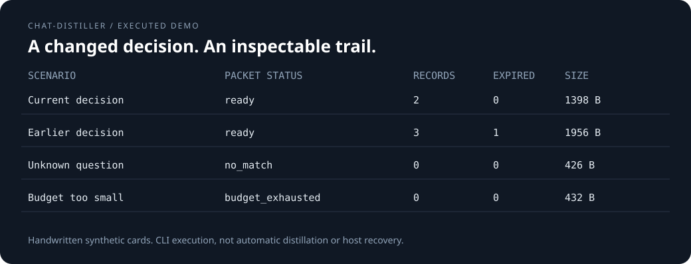
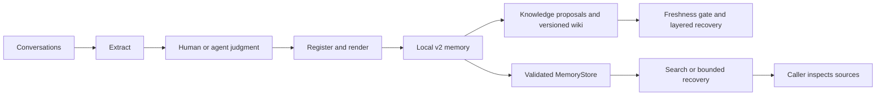

# chat-distiller

**Keep the decision. Keep the trail.**

Local, inspectable memory for long-running agents. Turn conversations into structured
records, retrieve them with explicit lifecycle states, and build source-linked recovery
packets within a byte budget. An optional LLM-Wiki-style compiler maintains versioned topic pages over that memory.

[](https://github.com/Anhao1314/chat-distiller/actions/workflows/tests.yml)
[](https://github.com/Anhao1314/chat-distiller/actions/workflows/evidence.yml)

**English** · [简体中文](README.zh-CN.md)  
[Try it](#quick-start) · [Python API](#python-api) · [Knowledge Wiki](#knowledge-wiki) · [Evidence](#evidence) · [Documentation](docs/README.md)



*Static display projection generated from actual CLI output, not a terminal recording
or a model evaluation. [Fixture and results](examples/recovery/expected.json).*

## Why this exists

A project changes direction. A session ends. The next agent needs to know **what is
current, what was replaced, and where the decision came from**, not just find familiar words.

chat-distiller keeps those distinctions explicit. A host agent or human decides what to
retain and whether a claim is current, expired, or disputed. Deterministic code registers
identities, renders files, validates supported projections, and retrieves records.

> Judgment belongs to the agent. Structure and integrity belong to deterministic code.

It is a memory component, not an autonomous agent, truth detector, or replacement for
semantic search. Obsidian is an optional reader, not a dependency.

<a id="quick-start"></a>
## Quick start

Python **3.9+**. The commands below use Bash and a source checkout. Installation may
fetch build tools; the runtime and demo need no model key or network service.

```bash
git clone https://github.com/Anhao1314/chat-distiller.git
cd chat-distiller
python3 -m venv .venv
. .venv/bin/activate
python -m pip install .
```

The bundled example contains **handwritten synthetic cards**, not automatically distilled
memories. It records a change from a hosted database to local SQLite and one unresolved
timeout. Run it in a new temporary vault, never in your personal knowledge base:

<!-- verify:quickstart -->
```bash
export DEMO_DIR="$(mktemp -d)"
mkdir "$DEMO_DIR/vault"
chat-distiller migrate --mode init --distill examples/recovery/distill.json --out "$DEMO_DIR/memory.json"
chat-distiller render --distill "$DEMO_DIR/memory.json" --vault "$DEMO_DIR/vault"
chat-distiller recover --vault "$DEMO_DIR/vault" --query database --max-bytes 4096 > "$DEMO_DIR/recovery.json"
python -m json.tool "$DEMO_DIR/recovery.json"
```

An excerpt of the actual recovery output follows. The complete packet also contains two
records, their source IDs, states, and full bodies. UUIDs and the source hash vary on each
new initialization; the byte count below is specific to this fixture.

<!-- verify:expected -->
```json
{
  "status": "ready",
  "requires_review": true,
  "used_bytes": 1398,
  "budget_bytes": 4096
}
```

`requires_review` is true because the unresolved timeout remains visible. `ready` means
records fit, **not** that a task has been completed. The old hosted-database card is absent
from current lookup; `--intent historical` makes it eligible again.

**Using your own data?** Follow [ingestion and migration](docs/ingestion.md). Existing v2
vaults need no schema migration for package 0.3.0. Back up legacy vaults before explicit
upgrade. Never use this demo's `init` output to replace an existing vault.

<a id="python-api"></a>
## Python API

With the same environment and `DEMO_DIR` from the quick start:

<!-- verify:sdk -->
```python
import os
from pathlib import Path
from chat_distiller import MemoryStore, serialize_packet

memory = MemoryStore(Path(os.environ["DEMO_DIR"]) / "vault")
hits = memory.search("database")
card = memory.get(hits[0]["memory_id"]) if hits else None
packet = memory.recover("database", max_bytes=4096)
wire = serialize_packet(packet)
assert len(wire.encode("utf-8")) == packet["used_bytes"] <= 4096
print(packet["status"], len(packet["memories"]), packet["requires_review"])
```

`MemoryStore` is **read-only**. Each operation revalidates published state; it does not
silently repair or migrate it. Use the explicit CLI commands for extraction, registration,
and rendering. [API, errors, and packet contract](docs/memory-engine.md).

<a id="knowledge-wiki"></a>
## Knowledge Wiki: compile, maintain, recover

**New in 0.3.0:** group atomic memories into source-linked topic pages inspired by the LLM Wiki pattern.
Keep one stable knowledge identity across revisions; retain old versions and scoped disputes.
Any change to the atomic source makes old pages stale, so they cannot silently serve as current knowledge.

After the quick start, reuse the same temporary `DEMO_DIR`:

<!-- verify:wiki -->
```bash
chat-distiller wiki prepare --vault "$DEMO_DIR/vault" --topic database --query database > "$DEMO_DIR/proposal.json"
chat-distiller wiki compile --vault "$DEMO_DIR/vault" --proposal "$DEMO_DIR/proposal.json"
chat-distiller wiki compile --vault "$DEMO_DIR/vault" --proposal "$DEMO_DIR/proposal.json" --apply
chat-distiller wiki recover --vault "$DEMO_DIR/vault" --query database --max-bytes 8192 > "$DEMO_DIR/knowledge.json"
chat-distiller wiki export --vault "$DEMO_DIR/vault" --out "$DEMO_DIR/wiki-view"
```

Preparation is extractive and offline. A host agent can rewrite the proposal into a synthesis before compilation;
all claims need literal memory citations and semantic synthesis remains review-required. Compilation validates by
default; only `--apply` publishes. The export is a static Markdown snapshot, not a live second authority.

[Complete guide and host workflow](docs/knowledge-wiki.md) · [Research and design](docs/wiki-design.md) ·
[Executed compiler experiments](benchmarks/wiki/results.md).
To run the full 16-command lifecycle demonstration: `python tools/wiki_demo.py --out /path/to/new-demo-directory`.

## How it works



Atomic memory has one core under `chat_distiller/_internal`; the optional compiler lives under `chat_distiller/wiki`. The unified CLI and
legacy scripts share it. The read-only API consumes the published source and its derived
index. Hooks only remind a host to look up memory; they do not call `recover` automatically.
[Detailed architecture and trust boundaries](docs/architecture.md).

| Property | Behavior and boundary |
| --- | --- |
| Stable identity | Persistent `memory_id`; display numbers and filenames remain reserved across updates. |
| Explicit lifecycle | `现行` (current), `已过期` (expired), `有争议` (disputed). Status is supplied, not inferred. |
| Checked reads | Reject source/registry/index inconsistency and supported note-projection drift; not full-file tamper detection. |
| Bounded recovery | Include whole records with provenance, or omit them. Count complete UTF-8 JSON bytes, **not tokens**. |
| Visible uncertainty | Distinguish `no_match` from `budget_exhausted`; preserve disputed and historical labels. |
| Local files | No third-party runtime dependencies. Local single-writer storage, not a transactional database. |

<a id="evidence"></a>
## Evidence, with the trade-off intact

**Synthetic development fixture: 40 sessions, 40 handwritten cards, 24 queries. Retrieval
only.** No independent holdout, automatic-distillation assessment, or final-agent-answer
assessment. The knowledge layer does not change this frozen retrieval benchmark or its scores.

| Method | Recall@1 | Recall@5 | MRR@5 | stale-hit@5 |
| --- | ---: | ---: | ---: | ---: |
| Raw transcript lexical baseline | 0.4167 | 0.9583 | 0.6528 | 0.5417 |
| Structured memory | 0.5417 | **1.0000** | 0.7604 | 0.5000 |
| Structured + status-aware | **0.7083** | 0.9167 | **0.7931** | 0.0000 |

Current-first ranking improves Recall@1 here but suppresses some relevant disputed cards:
**Recall@5 falls from 1.0000 to 0.9167.** Zero stale hits reflects filtering of explicitly
expired cards, not automatic detection of wrong or outdated facts. Historical queries may
legitimately need old records; expired-target recall is not measured by this fixture.

[Full results and intent slices](benchmarks/benchmark-results.md) · [Per-query JSON](benchmarks/benchmark-results.json) · [Verification ledger](docs/verification.md)

```bash
python3 -m unittest discover -s tests -v
python3 benchmarks/evaluate.py
python tools/verify_docs.py
```

The last command needs the installed CLI activated above. It runs the literal bilingual
quick-start and SDK examples, checks local documentation links, and verifies the demo
JSON/SVG against fresh execution. It does not fetch external links. CI also tests installed
wheels outside the source checkout; follow the badges for current results.

## Integration and scope

| Entry point | Available now |
| --- | --- |
| CLI | `extract`, `migrate`, `render`, `lint`, `search`, `get`, `inspect`, `recover` |
| Python | `MemoryStore.search/get/inspect/recover`, `KnowledgeStore`, `serialize_packet` |
| Knowledge CLI | `wiki prepare/compile/search/get/status/lint/recover/export` |
| Source adapters | Doubao Work local cache and Generic JSONL |
| Skill / hooks | [Host-agent instructions](SKILL.md) and [event templates](assets/hooks.example.json); native host compatibility is not established by offline tests. |

Not implemented: automatic semantic distillation, vector search, cross-layer transactional writes,
MCP, a web inspector, or native Codex/Claude history parsing. No real host-compaction
success rate or production-accuracy guarantee is claimed. Retrieved text is untrusted
input; labels alone do not prevent prompt injection. [Full limits](docs/memory-engine.md#boundaries).

## Documentation and contribution

[Documentation map](docs/README.md) · [Ingestion](docs/ingestion.md) · [Architecture](docs/architecture.md) · [Changelog](CHANGELOG.md) · [Contributing](CONTRIBUTING.md)

Bug reports are most useful with a minimal synthetic fixture, exact command, version,
and expected versus observed behavior. Do not publish personal conversations or credentials.

## License

[MIT](LICENSE).
