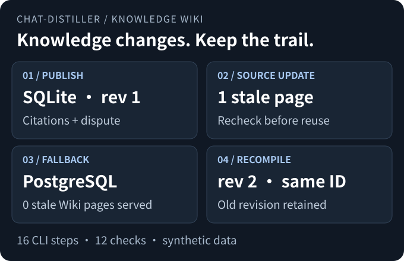
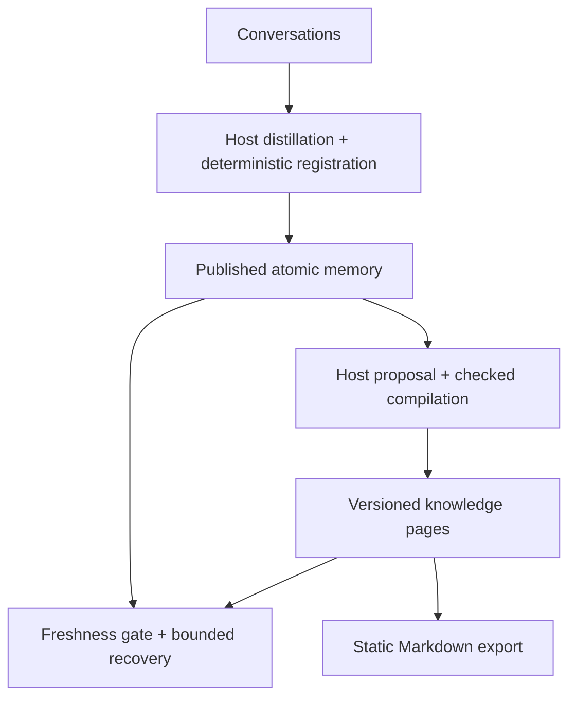

# chat-distiller

**Keep the decision. Keep the trail. Bring back the right context.**

Local persistent context for long-running agents. Connect Doubao Work once, incrementally stage
changed conversations, and recover task context without walking through the low-level pipeline.

[](https://github.com/Anhao1314/chat-distiller/actions/workflows/tests.yml)
[](https://github.com/Anhao1314/chat-distiller/actions/workflows/evidence.yml)

**English** · [简体中文](README.zh-CN.md)  
[Start: Doubao context](#start-here-three-commands) · [Engine demo](#demo) · [Advanced Wiki](#quick-start) · [Evidence](#evidence) · [Limits](#limits)



*Generated from the [16-step CLI demo](tools/wiki_demo.py) and its [checked receipt](examples/wiki/lifecycle.expected.json).
Synthetic data, a prewritten synthesis, and an extractive refresh. No model calls or live host-compaction test.*

## Built for work that spans conversations

| When you need to… | Use chat-distiller to… |
| --- | --- |
| Resume development after a handoff | Retrieve prior decisions, constraints, and their source records. |
| Keep a project knowledge base current | Maintain a topic page with stable identity, revisions, and explicit stale detection. |
| Give another agent focused context | Produce byte-bounded recovery packets; inspect the same knowledge as Markdown. |

Inspired by the **LLM Wiki** maintenance pattern, not a fork or a bundled third-party Wiki.
The additional layer is optional: existing v2 memory and `MemoryStore` still work without it.
[Design and attribution](docs/wiki-design.md).

> The host decides what information means. Code checks references, state, and publication.
> **A valid citation does not prove a synthesis is true.**

## Start here: three commands

**Python 3.9+ · package 0.4.0 · no third-party runtime dependencies.**

```bash
chat-distiller connect doubao
chat-distiller sync
chat-distiller context "continue the previous project"
```

On macOS, `connect` discovers the current Doubao Work session cache and creates a managed local
Context Home. `sync` only stages new or changed sessions and never writes to the Doubao source.
`context` prefers validated memory / Knowledge Wiki and, before semantic distillation exists,
can return byte-bounded raw excerpts marked `requires_review`.

Use `chat-distiller status` for health and `--json` for Agent-readable output.
If auto-discovery fails, pass `--sessions-root` once during connect.

Semantic judgment is still explicit. Sync writes a pending review bundle; a host Agent can publish
structured memory through the guarded proposal protocol. Source changes make an older proposal stale.

[Context Gateway guide](docs/context-gateway.md) · [Executed Gateway experiment](benchmarks/gateway/results.md)

<a id="demo"></a>
## Run the full lifecycle

**Engine demo; no real user data.**
Use Bash from a source checkout. Install from this repository, not an assumed PyPI release.
Installation may download build tools; the installed runtime and demo need no model key or service.

```bash
git clone https://github.com/Anhao1314/chat-distiller.git
cd chat-distiller
python3 -m venv .venv
. .venv/bin/activate
python -m pip install .
```

Already have a checkout? Update it without overwriting local work, then reinstall with
`python -m pip install .`. The following demo creates a **new disposable directory**, not a personal vault:

<!-- verify:lifecycle -->
```bash
export WIKI_DEMO_PARENT="$(mktemp -d)"
python tools/wiki_demo.py --out "$WIKI_DEMO_PARENT/run"
```

Actual summary excerpt; the complete output also reports twelve named checks and the receipt paths:

<!-- verify:lifecycle-expected -->
```json
{
  "ok": true,
  "model_calls": 0,
  "commands_executed": 16
}
```

The demo publishes a SQLite knowledge page, changes its source to PostgreSQL, excludes
the stale page during recovery, then recompiles under the **same knowledge ID** and retains revision 1.
It does not connect to or migrate a real database. The initial synthesis is prewritten, not model-generated during the run.

Open `$WIKI_DEMO_PARENT/run/wiki-v2/index.md` in a Markdown reader or Obsidian.
The same `run/` directory contains `wiki-v1/`, `proposal.json`, `summary.json`, and the raw step receipts.
**The exported Wiki is a static snapshot, not a live second authority.**

<a id="quick-start"></a>
<a id="knowledge-wiki"></a>
## Build and maintain a Wiki

Start with published v2 atomic memory. `prepare` selects records and produces an **extractive draft**;
a human or host agent can turn it into a synthesis while retaining citations and scoped disputes.
`compile` checks the proposal; **only `--apply` publishes it**.

<details>
<summary><strong>Manual walkthrough: disposable memory → proposal → checked Wiki</strong></summary>

Use the installed environment above, from the repository root. This separate walkthrough defines
`DEMO_DIR` for the Python example and the [ingestion guide](docs/ingestion.md).
The cards are handwritten synthetic input. Do not substitute a real vault for this disposable one.

<!-- verify:quickstart -->
```bash
export DEMO_DIR="$(mktemp -d)"
mkdir "$DEMO_DIR/vault"
chat-distiller migrate --mode init --distill examples/recovery/distill.json --out "$DEMO_DIR/memory.json"
chat-distiller render --distill "$DEMO_DIR/memory.json" --vault "$DEMO_DIR/vault"
chat-distiller recover --vault "$DEMO_DIR/vault" --query database --max-bytes 4096 > "$DEMO_DIR/recovery.json"
python -m json.tool "$DEMO_DIR/recovery.json"
```

Atomic recovery output excerpt; the full packet contains two complete records with sources.
IDs and source hashes vary on initialization; this byte count belongs to the fixed example.

<!-- verify:expected -->
```json
{
  "status": "ready",
  "requires_review": true,
  "used_bytes": 1398,
  "budget_bytes": 4096
}
```

`requires_review` is true because the unresolved timeout remains visible. `ready` means
records fit, not that an agent completed its task. `--intent historical` also allows the old hosted-database card.

Reuse the same `DEMO_DIR` to compile the knowledge layer:

<!-- verify:wiki -->
```bash
chat-distiller wiki prepare --vault "$DEMO_DIR/vault" --topic database --query database > "$DEMO_DIR/proposal.json"
chat-distiller wiki compile --vault "$DEMO_DIR/vault" --proposal "$DEMO_DIR/proposal.json"
chat-distiller wiki compile --vault "$DEMO_DIR/vault" --proposal "$DEMO_DIR/proposal.json" --apply
chat-distiller wiki recover --vault "$DEMO_DIR/vault" --query database --max-bytes 8192 > "$DEMO_DIR/knowledge.json"
chat-distiller wiki export --vault "$DEMO_DIR/vault" --out "$DEMO_DIR/wiki-view"
```

To practice host synthesis, edit `proposal.json` after `prepare` and before the validation command.
Keep quotes, source IDs, scope, and state. The walkthrough itself leaves the extractive draft unchanged.
See the [proposal contract](references/knowledge-schema.md) for the supported format.

</details>

**Your own conversations:** use the [ingestion and migration guide](docs/ingestion.md).
Inputs are Doubao Work local cache or Generic JSONL; a host agent or human performs semantic distillation.
Existing v2 vaults need no schema migration. Back up legacy vaults before explicit upgrade;
never replace existing identities with a new demo's `init` output.

After publishing, use `wiki status` to find stale pages and repeat prepare, review, validate, and apply.
The same topic retains its ID and prior revisions; an identical proposal returns `no_change`.
[Full Wiki guide](docs/knowledge-wiki.md).

<a id="python-api"></a>
## Python API

After the manual walkthrough above, reuse its environment and `DEMO_DIR`:

<!-- verify:sdk -->
```python
import os
from pathlib import Path
from chat_distiller import KnowledgeStore, MemoryStore, serialize_packet

vault = Path(os.environ["DEMO_DIR"]) / "vault"
memory = MemoryStore(vault)
wiki = KnowledgeStore(vault)

hits = memory.search("database")
page = wiki.get("database")
packet = wiki.recover("database", max_bytes=8192)
wire = serialize_packet(packet)
assert len(wire.encode("utf-8")) == packet["used_bytes"] <= 8192
print(packet["status"], len(packet["knowledge"]), packet["requires_review"])
```

`MemoryStore` is read-only. `KnowledgeStore` adds explicit preparation and publication;
`compile(proposal)` is a preview, while `compile(proposal, apply=True)` publishes.
Neither interface calls a model. [Memory API and errors](docs/memory-engine.md) · [Knowledge API](docs/knowledge-wiki.md#python-接口).

## Two layers, one source of record



The knowledge layer is derived from atomic memory. Any atomic-source change, **including an unrelated one**,
makes older compiled pages stale. Default Wiki search excludes them; layered recovery can fall back to
atomic records. That fallback is not a guarantee of complete topic or conflict coverage.

| Distinction | What it actually means |
| --- | --- |
| `current` / `historical` / `disputed` | Claim lifecycle supplied by the host, not automatic truth classification. |
| `fresh` / `stale` | Whether a compiled page matches the current source snapshot, not whether its claims are true. |
| Preview / publish | Validation alone does not write. Wiki publication has a cooperative lock and revision check, not a cross-layer transaction. |
| Byte budget / token budget | Count the whole UTF-8 JSON packet. Include complete knowledge units with support, or omit them; bytes are not tokens. |

[Architecture](docs/architecture.md) · [Knowledge contract](references/knowledge-schema.md) · [Research and trade-offs](docs/wiki-design.md).

<a id="evidence"></a>
## Evidence you can replay

### Knowledge lifecycle

**CompileBench: four topics, twelve curated atomic cards, no model calls.**
These are controlled engineering checks, not semantic accuracy or real-user task success.

| Check | Observed |
| --- | ---: |
| Invalid proposals blocked without creating compiled state | 16 / 16 |
| Complete UTF-8 packet budget checks | 16 / 16 |
| Stale pages served with the freshness gate disabled | 4 / 4 |
| Stale pages served with the freshness gate enabled | 0 / 4 |
| Updated topics retaining identity and the old revision | 4 / 4 |

The disabled-gate comparison is a controlled static consumer, not another Wiki product.
**Negative result retained:** an incorrect synthesis with a real quote can pass structural checks;
synthesis and inference remain review-required.
[Per-case results](benchmarks/wiki/results.json) · [Report and limitations](benchmarks/wiki/results.md) · [Wiki verification ledger](docs/wiki-verification.md).

<details>
<summary><strong>Atomic retrieval benchmark: unchanged, including its trade-off</strong></summary>

40 synthetic sessions, 40 handwritten cards, 24 queries. Retrieval only; no independent
holdout, automatic-distillation assessment, or final-answer evaluation. Wiki compilation does not change these scores.

| Method | Recall@1 | Recall@5 | MRR@5 | stale-hit@5 |
| --- | ---: | ---: | ---: | ---: |
| Raw transcript lexical | 0.4167 | 0.9583 | 0.6528 | 0.5417 |
| Structured memory | 0.5417 | **1.0000** | 0.7604 | 0.5000 |
| Structured + status-aware | **0.7083** | 0.9167 | **0.7931** | 0.0000 |

Current-first ranking improves Recall@1 in this fixture but suppresses some relevant disputed cards:
**Recall@5 falls from 1.0000 to 0.9167.** Zero stale hits reflects filtering of explicitly expired cards,
not detection of outdated facts. Historical queries may legitimately need old records;
expired-target recall is not measured here.
[Full results and intent slices](benchmarks/benchmark-results.md) · [Per-query JSON](benchmarks/benchmark-results.json) · [Atomic recovery display](assets/recovery-demo.svg).

</details>

With the installed environment active, run from the repository root:

```bash
python -m unittest discover -s tests -v
python benchmarks/evaluate.py
python benchmarks/wiki/evaluate.py --check
python tools/verify_docs.py
```

CI checks source tests, installed wheels outside the checkout, literal bilingual examples,
and generated demo assets. Documentation checks do not fetch external links.
Follow the badges for current runs; [README verification notes](docs/readme-polish.md) record the scope.

<a id="limits"></a>
## Deliberate boundaries

This is a **local memory and knowledge component**, not an autonomous agent or truth detector.
References, quotes, scope, status, and supported projections are checked; semantic correctness still needs review.
Retrieval is lexical, not embedding search. Source freshness is conservative, not automatic contradiction detection.

No built-in model service, MCP server, web UI, or native Codex/Claude history parser is provided.
[Skill instructions](SKILL.md) and [hook templates](assets/hooks.example.json) help a host use the tools;
hooks only remind it to look up memory. Offline tests do not establish native host-compaction compatibility.

Local guarded Wiki publication is not a transaction with the atomic renderer. A post-replacement error
can mean the commit already succeeded. Treat retrieved text as untrusted data; labels alone do not prevent prompt injection.
[Wiki boundaries and recovery](docs/knowledge-wiki.md) · [Memory boundaries](docs/memory-engine.md#boundaries).

## Documentation and contribution

[Documentation map](docs/README.md) · [Ingestion](docs/ingestion.md) · [Wiki tutorial](docs/knowledge-wiki.md) · [Changelog](CHANGELOG.md) · [Contributing](CONTRIBUTING.md)

For a reproducible issue, include a **synthetic fixture**, exact command, version, and expected versus
observed behavior. Keep private conversations and credentials out of public issues and commits.

## License

[MIT](LICENSE).
