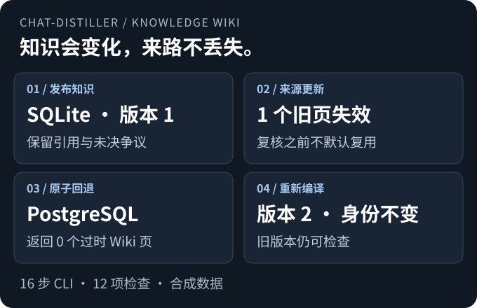
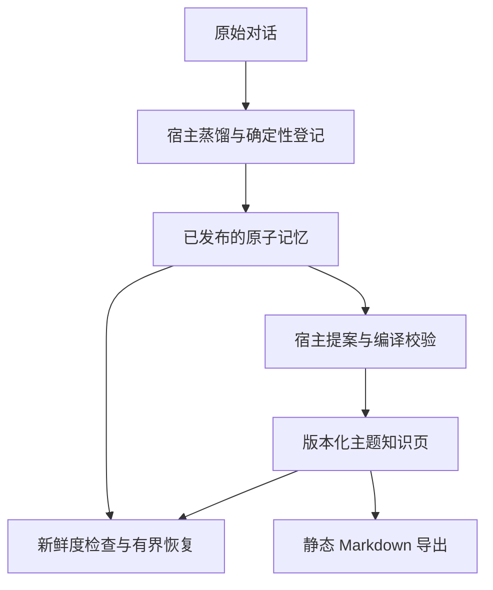

# chat-distiller

**记住决定，也保留来路。**

面向长期任务 Agent 的本地对话记忆与版本化知识 Wiki。
把已沉淀的决定整理成带引用的主题页，识别来源变化，并把相关知识与支持记录一起交还给 Agent。

[](https://github.com/Anhao1314/chat-distiller/actions/workflows/tests.yml)
[](https://github.com/Anhao1314/chat-distiller/actions/workflows/evidence.yml)

[English](README.md) · **简体中文**  
[运行演示](#demo) · [建立 Wiki](#quick-start) · [Python 接口](#python-api) · [实验证据](#evidence) · [能力边界](#limits)



*由 [16 步 CLI 演示](tools/wiki_demo.py)与[经过检查的结果](examples/wiki/lifecycle.expected.json)生成。
使用合成数据、预先撰写的综合与摘录式刷新；未调用模型，也未测试真实宿主上下文压缩。*

## 用在需要跨会话延续的工作中

| 你需要…… | 项目可以帮助你…… |
| --- | --- |
| 接手或继续一个开发任务 | 检索先前的决定、限制及来源记录。 |
| 维护持续变化的项目知识库 | 为主题页保留稳定身份、历史版本，并显式标记来源变化后的失效。 |
| 给另一个 Agent 提供必要上下文 | 生成受字节预算约束的恢复包，也可用 Markdown 检查同一份知识。 |

知识层吸收 **LLM Wiki** 的持续维护思想，不是 fork 或捆绑另一个 Wiki 项目。
它是可选层：原有 v2 记忆与 `MemoryStore` 仍可独立使用。[设计依据与致谢](docs/wiki-design.md)。

> 宿主负责理解含义；代码检查引用、状态与发布过程。
> **引用有效，不代表综合结论正确。**

<a id="demo"></a>
## 先跑一次完整生命周期

**Python 3.9+ · 包版本 0.3.0 · 无第三方运行时依赖。**
以下使用 Bash，从源码仓库安装，不假设本项目已经发布 PyPI。
安装时可能下载构建工具；安装后的运行时和演示都不需要模型密钥或服务。

```bash
git clone https://github.com/Anhao1314/chat-distiller.git
cd chat-distiller
python3 -m venv .venv
. .venv/bin/activate
python -m pip install .
```

已有仓库时，先在保留本地改动的前提下更新，再执行 `python -m pip install .` 重新安装。
下面的演示会新建**可丢弃的临时目录**，不使用你的真实知识库：

<!-- verify:lifecycle -->
```bash
export WIKI_DEMO_PARENT="$(mktemp -d)"
python tools/wiki_demo.py --out "$WIKI_DEMO_PARENT/run"
```

实际运行总结节选如下；完整输出还包含十二项具名检查和每一步的结果文件路径：

<!-- verify:lifecycle-expected -->
```json
{
  "ok": true,
  "model_calls": 0,
  "commands_executed": 16
}
```

演示先发布 SQLite 知识页，再把来源更新为 PostgreSQL；恢复时排除旧页，最后重新编译，
**知识 ID 不变，版本 1 仍可检查**。它不会连接或迁移真实数据库。首次综合是预先撰写的，不是在运行时由模型生成。

用 Markdown 阅读器或 Obsidian 打开 `$WIKI_DEMO_PARENT/run/wiki-v2/index.md`。
同一 `run/` 目录还保留 `wiki-v1/`、`proposal.json`、`summary.json` 和每一步原始结果。
**导出的 Wiki 是静态快照，不是自动同步的第二份数据权威。**

<a id="quick-start"></a>
<a id="knowledge-wiki"></a>
## 建立并维护 Wiki

以已发布的 v2 原子记忆为起点。`prepare` 选择记录并生成**摘录草稿**；
人或宿主 Agent 可以在保留引用和已选范围内争议的前提下改写成综合提案。
`compile` 检查提案，**只有加上 `--apply` 才会发布**。

<details>
<summary><strong>展开手动教程：临时记忆 → 提案 → 经过检查的 Wiki</strong></summary>

在仓库根目录使用上面已安装的环境。这条独立流程会定义 `DEMO_DIR`，供后面的 Python 示例和[摄入指南](docs/ingestion.md)复用。
输入是人工编写的合成卡片，不要把临时知识库路径替换为真实知识库。

<!-- verify:quickstart -->
```bash
export DEMO_DIR="$(mktemp -d)"
mkdir "$DEMO_DIR/vault"
chat-distiller migrate --mode init --distill examples/recovery/distill.json --out "$DEMO_DIR/memory.json"
chat-distiller render --distill "$DEMO_DIR/memory.json" --vault "$DEMO_DIR/vault"
chat-distiller recover --vault "$DEMO_DIR/vault" --query database --max-bytes 4096 > "$DEMO_DIR/recovery.json"
python -m json.tool "$DEMO_DIR/recovery.json"
```

原子记忆恢复结果节选如下；完整包包含两条记录及其来源。
每次初始化的 ID 和来源哈希不同，字节数只对应这个固定示例。

<!-- verify:expected -->
```json
{
  "status": "ready",
  "requires_review": true,
  "used_bytes": 1398,
  "budget_bytes": 4096
}
```

`requires_review` 为真，是因为未决的超时设置仍被保留。`ready` 表示记录装得下，不代表 Agent 已完成任务。
使用 `--intent historical` 还可让旧托管数据库方案参与检索。

复用同一个 `DEMO_DIR`，编译知识层：

<!-- verify:wiki -->
```bash
chat-distiller wiki prepare --vault "$DEMO_DIR/vault" --topic database --query database > "$DEMO_DIR/proposal.json"
chat-distiller wiki compile --vault "$DEMO_DIR/vault" --proposal "$DEMO_DIR/proposal.json"
chat-distiller wiki compile --vault "$DEMO_DIR/vault" --proposal "$DEMO_DIR/proposal.json" --apply
chat-distiller wiki recover --vault "$DEMO_DIR/vault" --query database --max-bytes 8192 > "$DEMO_DIR/knowledge.json"
chat-distiller wiki export --vault "$DEMO_DIR/vault" --out "$DEMO_DIR/wiki-view"
```

练习宿主综合时，在 `prepare` 后、校验前编辑 `proposal.json`，保留摘录、来源 ID、范围和状态。
这组命令本身不改写摘录草稿。支持的结构见[提案契约](references/knowledge-schema.md)。

</details>

**导入自己的对话：**按[摄入与迁移指南](docs/ingestion.md)操作。
当前支持豆包 Work 本地缓存与 Generic JSONL；语义蒸馏由宿主 Agent 或人完成。
已有 v2 知识库无需迁移。旧格式先备份再显式升级，不能用新演示的 `init` 结果覆盖已有身份。

发布后，用 `wiki status` 检查失效页，再重复准备、复核、校验和发布。
同一主题保留 ID 和旧版；完全相同的提案返回 `no_change`。[完整 Wiki 教程](docs/knowledge-wiki.md)。

<a id="python-api"></a>
## Python 接口

完成上面的手动教程后，复用它的环境与 `DEMO_DIR`：

<!-- verify:sdk -->
```python
import os
from pathlib import Path
from chat_distiller import KnowledgeStore, MemoryStore, serialize_packet

vault = Path(os.environ["DEMO_DIR"]) / "vault"
memory = MemoryStore(vault)
wiki = KnowledgeStore(vault)

hits = memory.search("database")
page = wiki.get("database")
packet = wiki.recover("database", max_bytes=8192)
wire = serialize_packet(packet)
assert len(wire.encode("utf-8")) == packet["used_bytes"] <= 8192
print(packet["status"], len(packet["knowledge"]), packet["requires_review"])
```

`MemoryStore` 是只读接口；`KnowledgeStore` 增加显式准备和发布。
`compile(proposal)` 只预检，`compile(proposal, apply=True)` 才发布。两者都不会调用模型。
[记忆接口与错误处理](docs/memory-engine.md) · [知识接口](docs/knowledge-wiki.md#python-接口)。

## 两层知识，一份原子记忆依据



知识层派生自原子记忆。任何原子来源变化，**包括不相关的变化**，都会使旧编译页失效。
默认 Wiki 检索排除这些页，分层恢复可回退到原子记录；回退并不保证覆盖整个主题或所有争议。

| 容易混淆的概念 | 实际含义 |
| --- | --- |
| `current` / `historical` / `disputed` | 由宿主提供的结论生命周期，不是自动真伪分类。 |
| `fresh` / `stale` | 编译页是否仍匹配当前来源快照，不代表其中的结论真实。 |
| 预检 / 发布 | 校验本身不落库；Wiki 发布有协作锁和修订号检查，但不是跨层事务。 |
| 字节预算 / token 预算 | 计算整个 UTF-8 JSON；完整知识单元与支持记录一起纳入或省略，字节不等于 token。 |

[完整架构](docs/architecture.md) · [知识契约](references/knowledge-schema.md) · [调研与取舍](docs/wiki-design.md)。

<a id="evidence"></a>
## 可以重放的实验证据

### 知识生命周期

**CompileBench：四个主题、十二张人工原子卡片、零模型调用。**
以下是受控工程检查，不是语义准确率或真实用户任务成功率。

| 检查项目 | 实际结果 |
| --- | ---: |
| 无效提案被拒绝，且未创建编译状态 | 16 / 16 |
| 完整 UTF-8 恢复包字节预算检查 | 16 / 16 |
| 关闭新鲜度检查后仍返回旧页 | 4 / 4 |
| 启用新鲜度检查后仍返回旧页 | 0 / 4 |
| 更新后保留知识身份与旧版的主题 | 4 / 4 |

关闭检查的对照是一个受控静态消费者，不是其他 Wiki 产品。
**保留的负面结果：**错误的综合结论附上真实摘录，仍可能通过结构检查；综合和推断始终需要复核。
[逐项结果](benchmarks/wiki/results.json) · [实验报告与限制](benchmarks/wiki/results.md) · [Wiki 实测台账](docs/wiki-verification.md)。

<details>
<summary><strong>原子记忆检索评测：分数不变，也保留代价</strong></summary>

40 个合成会话、40 张人工卡片、24 个问题。仅测检索，没有独立保留集、自动蒸馏评估或最终回答评估。
知识编译层不改变这些分数。

| 方法 | Recall@1 | Recall@5 | MRR@5 | stale-hit@5 |
| --- | ---: | ---: | ---: | ---: |
| 原始转录词面检索 | 0.4167 | 0.9583 | 0.6528 | 0.5417 |
| 结构化记忆 | 0.5417 | **1.0000** | 0.7604 | 0.5000 |
| 结构化 + 状态感知 | **0.7083** | 0.9167 | **0.7931** | 0.0000 |

现行优先在这组数据上提高了 Recall@1，但压低了部分相关争议卡片，**Recall@5 从 1.0000 降到 0.9167**。
零过期命中来自过滤已显式标记过期的卡片，不代表自动识别过时事实。
历史问题可能需要旧记录；这里尚未测量以过期卡片为正确目标的召回。
[完整结果与问题分类](benchmarks/benchmark-results.md) · [逐题 JSON](benchmarks/benchmark-results.json) · [原子恢复展示图](assets/recovery-demo.svg)。

</details>

激活已安装的环境，在仓库根目录执行：

```bash
python -m unittest discover -s tests -v
python benchmarks/evaluate.py
python benchmarks/wiki/evaluate.py --check
python tools/verify_docs.py
```

CI 检查源代码测试、脱离源码目录的 wheel 安装、双语文档中的实际命令以及演示产物。
文档检查不会请求外部链接。当前运行结果见顶部徽章，[本轮验证记录](docs/readme-polish.md)说明验收范围。

<a id="limits"></a>
## 明确的能力边界

这是**本地记忆与知识组件**，不是自主 Agent 或事实鉴定器。
程序检查引用、摘录、范围、状态和受支持的投影字段；语义正确性仍需复核。
检索采用词面匹配，不是向量搜索；来源新鲜度检查采取保守策略，不等于自动识别矛盾。

不内置模型服务、MCP、Web 界面，也不解析 Codex/Claude 原生历史。
[Skill 说明](SKILL.md)与[hook 模板](assets/hooks.example.json)帮助宿主使用工具；hook 只提醒查记忆。
离线测试不能证明具体宿主上下文压缩事件的兼容性。

Wiki 的本地受控发布，不是与原子记忆渲染器的联合事务。替换后的错误可能意味着提交已经生效。
检索正文始终按不可信数据处理；加标签本身不能阻止提示注入。
[Wiki 边界与恢复](docs/knowledge-wiki.md) · [记忆层边界](docs/memory-engine.md#boundaries)。

## 文档与贡献

[文档导航](docs/README.md) · [摄入指南](docs/ingestion.md) · [Wiki 教程](docs/knowledge-wiki.md) · [更新记录](CHANGELOG.md) · [参与贡献](CONTRIBUTING.md)

报告问题时请提供**最小合成样例**、准确命令、版本，以及预期与实际行为。
不要把私人对话或凭证放进公开 issue 和提交。

## 许可

[MIT](LICENSE)。
