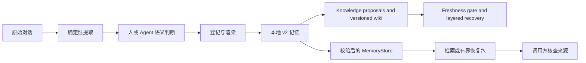

# chat-distiller

**记住决定，也保留来路。**

面向长期任务 Agent 的本地结构化记忆工具。把对话沉淀为可检查的记录，按明确的生命周期状态检索，
并在字节预算内生成带来源的上下文恢复包。新增 LLM Wiki 风格的知识编译层，持续维护带版本的主题页。

[](https://github.com/Anhao1314/chat-distiller/actions/workflows/tests.yml)
[](https://github.com/Anhao1314/chat-distiller/actions/workflows/evidence.yml)

[English](README.md) · **简体中文**  
[快速体验](#quick-start) · [Python 接口](#python-api) · [知识 Wiki](#knowledge-wiki) · [评测证据](#evidence) · [文档导航](docs/README.md)


*这张静态展示图由实际 CLI 输出生成，不是终端录像，也不是模型效果评测。[示例与结果](examples/recovery/expected.json)。*

## 解决什么问题

项目换了方案，会话结束了。接手的 Agent 需要知道的不是“出现过哪些相似词”，而是：
**现在采用什么、过去放弃了什么、决定来自哪里。**

chat-distiller 显式保留这些区别。宿主 Agent 或人负责决定保留什么，以及知识是现行、已过期还是有争议；
确定性代码负责登记身份、渲染文件、校验支持的投影字段，并检索记录。

> 语义判断交给 Agent；结构与完整性检查交给确定性代码。

它是记忆组件，不是自主 Agent、事实鉴定器或语义搜索替代品。Obsidian 只是可选阅读器，不是运行依赖。

<a id="quick-start"></a>
## 快速体验

需要 Python **3.9+**。以下命令使用 Bash，并在源码仓库中运行。安装时可能下载构建工具；
运行时和演示都不需要模型密钥或网络服务。

```bash
git clone https://github.com/Anhao1314/chat-distiller.git
cd chat-distiller
python3 -m venv .venv
. .venv/bin/activate
python -m pip install .
```

随仓库提供的是**人工编写的合成卡片**，不是自动蒸馏结果。它记录从托管数据库改为本地 SQLite 的决定，
以及仍未解决的超时设置。下面会新建临时知识库，不要替换成你的真实知识库路径：

<!-- verify:quickstart -->
```bash
export DEMO_DIR="$(mktemp -d)"
mkdir "$DEMO_DIR/vault"
chat-distiller migrate --mode init --distill examples/recovery/distill.json --out "$DEMO_DIR/memory.json"
chat-distiller render --distill "$DEMO_DIR/memory.json" --vault "$DEMO_DIR/vault"
chat-distiller recover --vault "$DEMO_DIR/vault" --query database --max-bytes 4096 > "$DEMO_DIR/recovery.json"
python -m json.tool "$DEMO_DIR/recovery.json"
```

实际恢复结果节选如下。完整输出还包含两条记录、来源 ID、状态和完整正文。每次新初始化生成的 UUID
和源文件哈希不同；下面的字节数仅对应这个固定示例。

<!-- verify:expected -->
```json
{
  "status": "ready",
  "requires_review": true,
  "used_bytes": 1398,
  "budget_bytes": 4096
}
```

`requires_review` 为真，是因为未决的超时设置仍被明确展示。`ready` 只表示记录装得下，**不代表任务已经完成**。
当前查询不返回旧托管方案；使用 `--intent historical` 可让旧记录重新参与检索。

**接入自己的数据？** 先读[摄入与迁移指南](docs/ingestion.md)。已有 v2 知识库不需要因安装 0.3.0 包而迁移；
旧格式知识库应先备份再显式升级。不要拿演示 `init` 生成的身份覆盖已有知识库。

<a id="python-api"></a>
## Python 接口

复用上面已激活的环境和 `DEMO_DIR`：

<!-- verify:sdk -->
```python
import os
from pathlib import Path
from chat_distiller import MemoryStore, serialize_packet

memory = MemoryStore(Path(os.environ["DEMO_DIR"]) / "vault")
hits = memory.search("database")
card = memory.get(hits[0]["memory_id"]) if hits else None
packet = memory.recover("database", max_bytes=4096)
wire = serialize_packet(packet)
assert len(wire.encode("utf-8")) == packet["used_bytes"] <= 4096
print(packet["status"], len(packet["memories"]), packet["requires_review"])
```

`MemoryStore` 是**只读接口**，每次操作重新验证已发布状态，不会静默修复或迁移数据。
提取、登记和渲染仍通过显式 CLI 命令执行。[接口、错误与恢复包契约](docs/memory-engine.md)。

<a id="knowledge-wiki"></a>
## Knowledge Wiki：编译、维护、恢复

**0.3.0 新增：**吸收 LLM Wiki 思想，将原子记忆整理为带来源的主题知识页。
同一主题保留稳定身份和历史版本，已选中的争议不能被静默删去。原子源发生变化后，旧页标记为 stale，
不再进入默认知识检索。

完成快速体验后，复用同一个临时 `DEMO_DIR`：

<!-- verify:wiki -->
```bash
chat-distiller wiki prepare --vault "$DEMO_DIR/vault" --topic database --query database > "$DEMO_DIR/proposal.json"
chat-distiller wiki compile --vault "$DEMO_DIR/vault" --proposal "$DEMO_DIR/proposal.json"
chat-distiller wiki compile --vault "$DEMO_DIR/vault" --proposal "$DEMO_DIR/proposal.json" --apply
chat-distiller wiki recover --vault "$DEMO_DIR/vault" --query database --max-bytes 8192 > "$DEMO_DIR/knowledge.json"
chat-distiller wiki export --vault "$DEMO_DIR/vault" --out "$DEMO_DIR/wiki-view"
```

`prepare` 离线生成摘录草稿；宿主 Agent 可以在编译前将它改成综合提案。每条结论都需保留记忆引用，
综合内容始终需要语义复核。`compile` 默认只校验，`--apply` 才发布；导出的 Markdown 是静态快照，不是第二份权威。

[完整教程与宿主工作流](docs/knowledge-wiki.md) · [调研和设计](docs/wiki-design.md) ·
[已运行的编译实验](benchmarks/wiki/results.md)。
完整 16 步 CLI 演示：`python tools/wiki_demo.py --out /path/to/new-demo-directory`。

## 工作方式



原子记忆核心位于 `chat_distiller/_internal`，可选知识编译层位于 `chat_distiller/wiki`；统一 CLI 与旧脚本共享实现；只读接口消费已发布源数据和派生索引。
Hook 只提醒宿主查记忆，不会自动调用 `recover`。[详细架构与信任边界](docs/architecture.md)。

| 特性 | 行为与边界 |
| --- | --- |
| 稳定身份 | 持久化 `memory_id`；更新后仍保留已分配的展示编号与文件名。 |
| 显式生命周期 | `现行`、`已过期`、`有争议`。状态由人或宿主提供，不是自动推断。 |
| 读取校验 | 阻断源、登记表、索引不一致与受支持笔记字段的漂移；不等于全文防篡改。 |
| 有界恢复 | 完整记录与来源一起进入恢复包，装不下则省略；预算计算完整 UTF-8 JSON 字节，**不是 token**。 |
| 不确定性可见 | 区分 `no_match` 和 `budget_exhausted`；保留争议与历史状态。 |
| 本地文件 | 无第三方运行时依赖；单写者本地存储，不是事务数据库。 |

<a id="evidence"></a>
## 评测证据，也保留取舍

**合成开发集：40 个会话、40 张人工卡片、24 个问题，仅测检索。** 没有独立保留集，也未评估自动蒸馏质量
或 Agent 最终回答。新增知识层不改变这份冻结检索评测及其分数。

| 方法 | Recall@1 | Recall@5 | MRR@5 | stale-hit@5 |
| --- | ---: | ---: | ---: | ---: |
| 原始转录词面检索 | 0.4167 | 0.9583 | 0.6528 | 0.5417 |
| 结构化记忆 | 0.5417 | **1.0000** | 0.7604 | 0.5000 |
| 结构化 + 状态感知 | **0.7083** | 0.9167 | **0.7931** | 0.0000 |

现行优先在这里提高了 Recall@1，但也压低了部分相关争议卡片：**Recall@5 从 1.0000 降至 0.9167**。
零过期命中来自对已显式标记过期卡片的过滤，不意味着系统能自动识别错误或过时事实。
历史问题可能需要旧记录；这个固定评测集尚未测量以过期卡片为正确目标的召回。

[完整结果与问题分类](benchmarks/benchmark-results.md) · [逐题 JSON](benchmarks/benchmark-results.json) · [实测台账](docs/verification.md)

```bash
python3 -m unittest discover -s tests -v
python3 benchmarks/evaluate.py
python tools/verify_docs.py
```

最后一条命令需要激活前面安装好的 CLI 环境。它直接执行中英文 README 中的快速体验和 SDK 示例，
检查本地文档链接，并将新运行结果与演示 JSON、SVG 比对；不请求外部链接。
CI 还会脱离源码目录测试已安装的 wheel；当前结果以顶部徽章链接的实际运行为准。

## 接入方式与当前范围

| 入口 | 当前支持 |
| --- | --- |
| CLI | `extract`、`migrate`、`render`、`lint`、`search`、`get`、`inspect`、`recover` |
| Python | `MemoryStore.search/get/inspect/recover`、`KnowledgeStore`、`serialize_packet` |
| 知识 CLI | `wiki prepare/compile/search/get/status/lint/recover/export` |
| 数据输入 | 豆包 Work 本地缓存、Generic JSONL |
| Skill / hooks | [宿主 Agent 操作说明](SKILL.md)与[事件模板](assets/hooks.example.json)；离线测试不证明具体宿主版本兼容。 |

尚未实现自动语义蒸馏、向量检索、跨层事务写入、MCP、Web 检查器或 Codex/Claude 原生历史解析。
不宣称真实宿主压缩后的任务成功率或生产准确率。检索到的正文是不可信输入；加标签不等于解决提示注入。
[完整边界](docs/memory-engine.md#boundaries)。

## 文档与贡献

[文档导航](docs/README.md) · [摄入指南](docs/ingestion.md) · [架构](docs/architecture.md) · [更新记录](CHANGELOG.md) · [参与贡献](CONTRIBUTING.md)

提交问题时，请附最小合成样例、准确命令、版本，以及预期与实际行为。不要公开真实私人对话或凭证。

## 许可

[MIT](LICENSE)。
