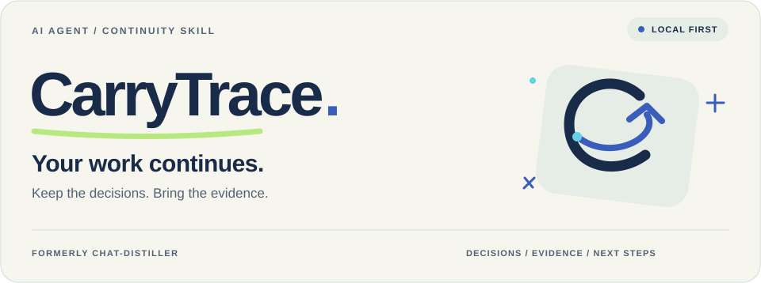

<picture>
  <source media="(prefers-color-scheme: dark) and (prefers-reduced-motion: no-preference)" srcset="assets/brand/hero-dark.svg">
  <source media="(prefers-reduced-motion: no-preference)" srcset="assets/brand/hero-light.svg">
  <source media="(prefers-color-scheme: dark)" srcset="assets/brand/hero-dark-static.svg">
  
</picture>

# CarryTrace · 续迹

**AI Agent 的工作接续 Skill。** 先恢复过去的决策、约束和有来源的上下文，再继续下一步工作。

原名 **chat-distiller**。保留已有本地记忆引擎，以更清楚的 Skill 入口交付。运行时不需要新账号、托管数据库或额外模型密钥。

[](https://github.com/Anhao1314/CarryTrace/actions/workflows/tests.yml)
[](https://github.com/Anhao1314/CarryTrace/actions/workflows/evidence.yml)

[安装](#install) · [安全升级](docs/brand-migration.md) · [工作方式](#how-it-works) · [实验证据](#evidence) · [English](README.md)

<a id="install"></a>
## 安装一次，带着上下文继续。

**首次安装：** 使用有本地 Shell 权限的 Agent 和 Python 3.9+。从本仓库安装，不要假定 PyPI 上名为 `carrytrace` 的包就是本项目。

```bash
git clone https://github.com/Anhao1314/CarryTrace.git
cd CarryTrace
python3 -m venv .venv
. .venv/bin/activate
python -m pip install .
carrytrace skill install --host codex --scope user
```

Claude Code 使用 `--host claude`，同时安装两个本地宿主使用 `--host both`。宿主需要能从这个 Python 环境执行 CLI。

**已经安装 chat-distiller？** 在同一个 Python 环境更新后，按[先预览、后执行的迁移指南](docs/brand-migration.md)处理，不要在同一宿主和作用域里同时保留两个活跃 Skill 名称。

之后直接告诉 Agent：

> 继续上次的项目。动代码之前，先恢复之前的决策、约束和未完成事项。

首次使用仍需要明确授权一个本地来源，或提供已有知识库。Gateway 自动发现目前只支持豆包 Work 本地缓存。安装 Skill 不会自动获得 Codex、Claude 或 ChatGPT 的历史记录。

## 不只是换个窗口继续聊

| 你的任务 | CarryTrace 帮宿主完成什么 |
| --- | --- |
| 接续开发 | 找回先前决定与约束，保留来源标识。 |
| 审查旧决定 | 区分当前、已替代和仍有争议的信息。 |
| 交给另一个 Agent | 生成有预算限制的上下文包，发送前确认目标授权。 |

[Skill 使用指南](docs/skill-first.md) · [可移植 Skill](chat_distiller/skills/carrytrace/SKILL.md)

```bash
carrytrace skill status --host codex --scope user --json
carrytrace skill export --out carrytrace-skill.zip
```

ZIP 只包含指令，不包含运行时程序或私人记忆。能否导入和自动触发取决于目标宿主，离线测试不等于真实宿主兼容认证。

<a id="how-it-works"></a>
## 一个 Skill，复用已有的本地引擎。

**你提出任务 → 宿主读取 Skill → 本地引擎检索证据 → 宿主复核并继续工作。**

Skill 负责选择工作流；Context Gateway 恢复相关上下文；Memory Engine 保留稳定身份；Knowledge Wiki 维护派生知识与版本。含义仍由人或获授权宿主判断。引用有效，不代表结论正确。

新增入口为 `carrytrace`，旧的 `chat-distiller` 命令、`chat_distiller` 导入名、`CHAT_DISTILLER_HOME` 与 `~/.chat-distiller` 数据目录均保留。品牌试验期间运行时仍为 **0.4.0**，不需要重新初始化记忆，也不另建一份数据库。

<details>
<summary><strong>展开高级引擎流程与旧 CLI 兼容示例</strong></summary>

## 从这里开始：三个命令

[Context Gateway 指南](docs/context-gateway.md)：原有 `connect / sync / context` 流程保留。最近会话回退不等于词法匹配。

<a id="demo"></a>
## 完整生命周期演示

在已经安装本包的环境、仓库根目录执行合成演示。它会创建新的临时目录，不使用个人知识库。示例从 SQLite 改为 PostgreSQL，但不会连接或迁移真实数据库。

<!-- verify:lifecycle -->
```bash
export WIKI_DEMO_PARENT="$(mktemp -d)"
python tools/wiki_demo.py --out "$WIKI_DEMO_PARENT/run"
```

<!-- verify:lifecycle-expected -->
```json
{
  "ok": true,
  "model_calls": 0,
  "commands_executed": 16
}
```

16 步命令、12 项检查使用人工编写的输入、预写综合与摘录式刷新，不调用模型。[演示源码](tools/wiki_demo.py) · [结果凭据](examples/wiki/lifecycle.expected.json)。


<a id="quick-start"></a>
<a id="knowledge-wiki"></a>
## 手动记忆与 Wiki 教程

在仓库中使用已安装 CLI。下面定义的 `DEMO_DIR` 也供 SDK 与摄入示例使用。卡片是合成数据；绝不能用新身份初始化覆盖已有知识库。

<!-- verify:quickstart -->
```bash
export DEMO_DIR="$(mktemp -d)"
mkdir "$DEMO_DIR/vault"
chat-distiller migrate --mode init --distill examples/recovery/distill.json --out "$DEMO_DIR/memory.json"
chat-distiller render --distill "$DEMO_DIR/memory.json" --vault "$DEMO_DIR/vault"
chat-distiller recover --vault "$DEMO_DIR/vault" --query database --max-bytes 4096 > "$DEMO_DIR/recovery.json"
python -m json.tool "$DEMO_DIR/recovery.json"
```

<!-- verify:expected -->
```json
{
  "status": "ready",
  "requires_review": true,
  "used_bytes": 1398,
  "budget_bytes": 4096
}
```

`ready` 只表示记录装得下，不表示结论正确或任务完成。未解决的超时争议仍需要复核。预算计算完整 UTF-8 JSON 字节数，不是 token。

<!-- verify:wiki -->
```bash
chat-distiller wiki prepare --vault "$DEMO_DIR/vault" --topic database --query database > "$DEMO_DIR/proposal.json"
chat-distiller wiki compile --vault "$DEMO_DIR/vault" --proposal "$DEMO_DIR/proposal.json"
chat-distiller wiki compile --vault "$DEMO_DIR/vault" --proposal "$DEMO_DIR/proposal.json" --apply
chat-distiller wiki recover --vault "$DEMO_DIR/vault" --query database --max-bytes 8192 > "$DEMO_DIR/knowledge.json"
chat-distiller wiki export --vault "$DEMO_DIR/vault" --out "$DEMO_DIR/wiki-view"
```

`prepare` 生成摘录草稿，宿主负责语义综合；`compile` 默认预览，只有 `--apply` 才发布。包括无关修改在内的源变化都会使旧页失效；重编译同一主题会保留身份与旧版本。Markdown 导出是时点快照，不是第二份权威。[Wiki 指南](docs/knowledge-wiki.md) · [摄入](docs/ingestion.md)。

<a id="python-api"></a>
## Python API

<!-- verify:sdk -->
```python
import os
from pathlib import Path
from chat_distiller import KnowledgeStore, MemoryStore, serialize_packet

vault = Path(os.environ["DEMO_DIR"]) / "vault"
memory = MemoryStore(vault)
wiki = KnowledgeStore(vault)

hits = memory.search("database")
page = wiki.get("database")
packet = wiki.recover("database", max_bytes=8192)
wire = serialize_packet(packet)
assert len(wire.encode("utf-8")) == packet["used_bytes"] <= 8192
print(packet["status"], len(packet["knowledge"]), packet["requires_review"])
```

`MemoryStore` 只读；`KnowledgeStore.compile(..., apply=True)` 才显式发布。两者都不调用模型。

</details>

<a id="evidence"></a>
## 可重放的实验证据

**CompileBench：** 四个主题、十二张人工编写的原子卡片、零模型调用。这是工程检查，不是语义准确率或真实用户任务成功率。

| 检查项目 | 实际结果 |
| --- | ---: |
| 无效提案被拒绝，且未创建编译状态 | 16 / 16 |
| 完整 UTF-8 恢复包字节预算检查 | 16 / 16 |
| 关闭新鲜度检查后仍返回旧页 | 4 / 4 |
| 启用新鲜度检查后仍返回旧页 | 0 / 4 |
| 更新后保留知识身份与旧版的主题 | 4 / 4 |

带有真实摘录的错误综合仍可能通过结构校验，引用不证明结论被来源支持。[结果与局限](benchmarks/wiki/results.md)。

<details>
<summary>原始检索基准，保留其代价</summary>

40 个合成会话、40 张手写卡片、24 条查询。只测检索，没有独立留出集，也没有评测 Agent 最终回答。

| 方法 | Recall@1 | Recall@5 | MRR@5 | stale-hit@5 |
| --- | ---: | ---: | ---: | ---: |
| 原始转录词面检索 | 0.4167 | 0.9583 | 0.6528 | 0.5417 |
| 结构化记忆 | 0.5417 | **1.0000** | 0.7604 | 0.5000 |
| 结构化 + 状态感知 | **0.7083** | 0.9167 | **0.7931** | 0.0000 |

状态排序在这组数据中提升 Recall@1，却使 Recall@5 从 1.0000 降至 0.9167，并可能压低争议卡片。零过期命中来自过滤已声明过期的记录，不是自动识别失效事实。[逐例结果与意图切片](benchmarks/benchmark-results.md)。

</details>

```bash
python -m unittest discover -s tests -v
python tools/build_brand_assets.py --check
python tools/verify_docs.py
```

<a id="limits"></a>
## 能力边界，不藏在口号里

这是以 Skill 暴露的本地记忆与知识组件，不是自主 Agent 或真伪检测器。检索是词法检索，不是向量搜索；语义复核仍由宿主或人完成。不宣称提供内置模型服务、MCP 服务、Web UI、Codex/Claude 原生历史解析器或通用压缩钩子。钩子模板只负责提醒。Wiki 层借鉴 LLM Wiki 维护模式，不是 fork 或捆绑第三方 Wiki。[架构](docs/architecture.md) · [设计与致谢](docs/wiki-design.md)。

记忆正文是不可信数据。不能绕过损坏检查，不可提交私人会话；替换后的写入错误可能意味着状态已经发布。旧多文件渲染器不是跨层事务。品牌迁移只处理指令目录，使用有限作用域锁与保留备份；它本身不能证明真实宿主触发成功或 Agent 任务质量提升。[迁移与恢复](docs/brand-migration.md)。

## 文档与贡献

[Documentation](docs/README.md) · [Skill guide](docs/skill-first.md) · [Python API](docs/memory-engine.md) · [Changelog](CHANGELOG.md) · [Contributing](CONTRIBUTING.md)

公开问题请提供合成复现材料，不要提交私人会话或凭据。

## License

[MIT](LICENSE).
