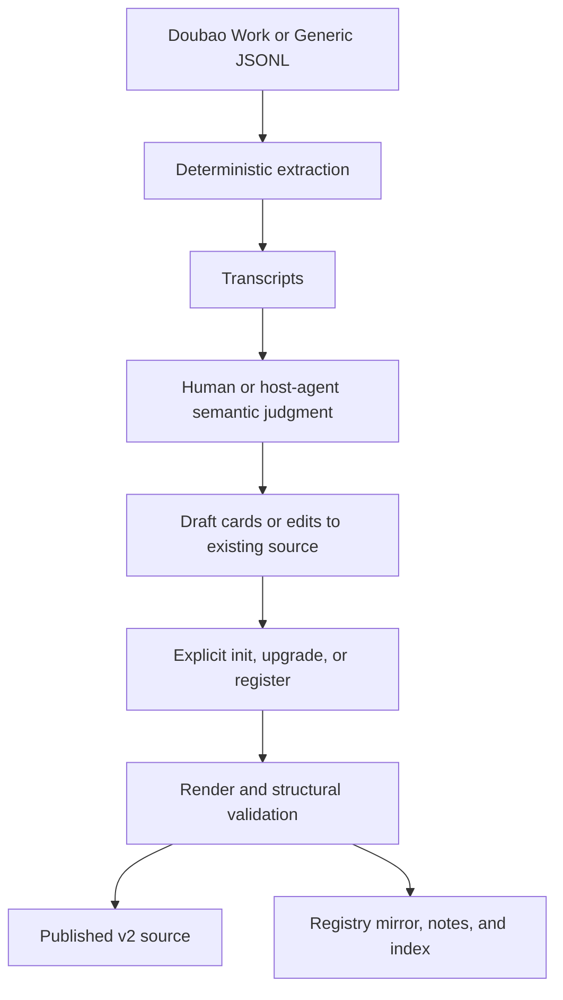

# Architecture and trust boundaries

chat-distiller has two paths: **explicit publishing** and **validated reading**.
Neither path makes model judgments disappear. A structurally consistent claim can still
be wrong, outdated, or malicious.

## 1. Publish structured memory



The semantic step selects claims, states, and relationships. It is not a hidden model
service inside this package. The [demo fixture](../examples/recovery/distill.json) is
handwritten and skips that judgment step; it does not measure distillation quality.

For a new source, `migrate --mode init` allocates identities. For an existing v2 source,
`register` adds identities without replacing old ones. Legacy vaults use an explicit
`upgrade` with validation against existing files. [Migration contract](../references/stable-memory.md).

## 2. Read and construct recovery packets


`search`, `get`, `inspect`, and `recover` do not write to the vault. Each operation checks
published source consistency, the registry mirror, supported note projections, and the
regenerated index. `get` can inspect an expired record by stable ID. Search and recovery
use cards, not conversation summaries that could bypass claim-level status filtering.

`current` and `historical` are caller-selected retrieval policies, not inferred time
intervals. Current mode filters declared expired cards and ranks current cards before
disputed ones. Historical mode includes all states. This is not automatic temporal
reasoning or conflict detection.

## Authority, not two databases

| Object | Responsibility |
| --- | --- |
| Complete v2 source and embedded `identity_registry` | Identity authority, including retired reservations |
| Published `.chat-distiller/distill.json` | Last published source snapshot |
| Separate registry JSON, notes, and indexes | Derived projections, checked rather than silently trusted |
| Recovery packet | A read-only selection identified by source SHA-256; not a new source of truth |
| Human / host agent | Semantic judgment, source inspection, and decisions about what to do next |

The source hash identifies bytes; it is not an authenticity signature. Supported note
checks cover identity/status/type projections, not every Markdown body byte. Returned
bodies come from the source-derived index, not unchecked edits to generated Markdown.

## Storage layout

```text
<vault>/对话沉淀/
├── 会话笔记/                     # readable conversation notes
├── 知识卡片/                     # readable atomic cards
├── 知识索引.md / 知识索引.jsonl  # derived indexes
├── 操作日志.md                   # operation log, not a transaction journal
├── 00 · 对话沉淀 MOC.md / 沉淀索引.base
└── .chat-distiller/
    ├── distill.json              # published source
    ├── identity-registry.json    # checked mirror
    ├── taxonomy.md               # vocabulary owned by this vault
    └── pending/                  # hook markers, not distilled memories
```

Core code lives under `chat_distiller/_internal`; `scripts/` contains compatible entry
points, not a second implementation. The original standalone compaction hook remains
separate. Templates are packaged for installed use; an existing vault's vocabulary is
not reset by an upgrade.

## Failure boundaries

Reads reject detected inconsistency instead of returning apparently valid results.
This is local single-writer storage: source-before/source-after checks are not a lock,
transaction, hostile-filesystem defense, or crash-recovery journal. Repair from a
consistent source or backup; do not bypass a failed check to obtain a result.

Recovery can return `ready`, `no_match`, or `budget_exhausted`. Whole records retain
sources and states; oversized records are skipped rather than truncated. The serialized
UTF-8 budget includes metadata and a newline. [Full packet contract](memory-engine.md#recovery-packet-contract).

Memory text remains untrusted data. This component does not execute it or send it to a
model. The caller must enforce its own tool permissions and instruction boundaries.
A status flag or hash alone does not prevent prompt injection.
